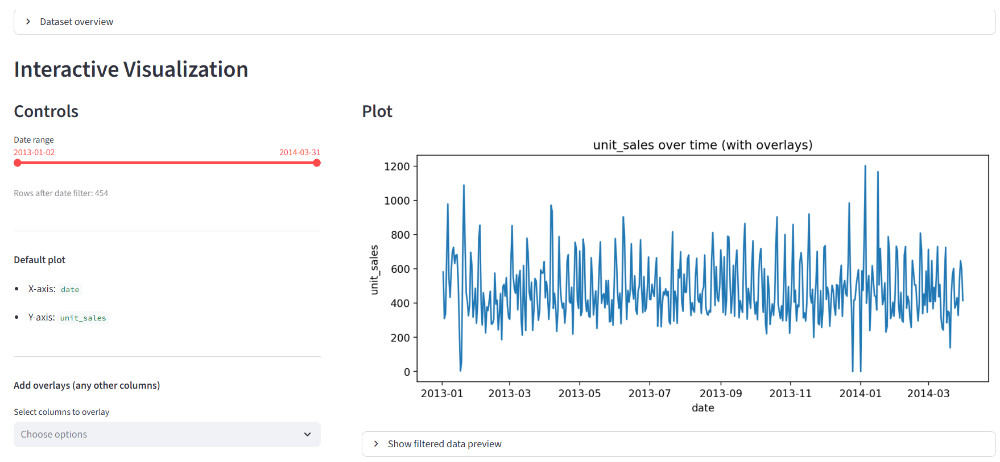

# 📈 Time Series Forecasting – Favorita Store

Interactive visualization of the time series and external drivers.

Time series forecasting project using statistical and machine learning models with external data sources (weather, holidays, macroeconomic indicators) and an interactive Streamlit dashboard.

### Project Overview

This project analyzes daily retail sales data and builds forecasting models to understand demand patterns.
The analysis integrates multiple external data sources, including weather conditions, holidays, macroeconomic indicators, and oil prices, to evaluate their influence on sales behavior.

The project includes:

* exploratory time series analysis 
* feature engineering 
* statistical forecasting models 
* machine learning models 
* an interactive Streamlit dashboard for visualization.

### Data Sources

The dataset combines several sources:

* Retail sales data – daily unit sales 
* Weather data (NASA POWER API) – solar radiation, temperature, precipitation 
* Holiday data – national and local holidays 
* Macroeconomic indicators – consumer price index and minimum wage 
* Oil prices – global oil price index

These datasets were merged to create a unified daily time series dataset.

### Feature Engineering

Several features were created to capture temporal structure and external drivers:

#### Lag features

* lag_1, lag_7, lag_14

#### Rolling statistics

* rolling_mean_7 
* rolling_std_7

#### Calendar variables

* day_of_week 
* month 
* is_weekend

#### External variables

* weather indicators (is_sunny, is_rainy) 
* oil price 
* holiday indicators

### Models Implemented
#### Statistical Time Series Models

* Naive baseline 
* Exponential Smoothing (ETS) 
* ARIMA 
* SARIMA 
* Theta Model 
* Prophet 

#### Machine Learning Models

* Linear Regression (with engineered features) 
* Random Forest 
* XGBoost

### Results Summary

Models incorporating trend and weekly seasonality performed best.

| Model         | RMSE |
|---------------| ---- |
| Prophet       | ~150 |
| ETS           | ~150 |
| SARIMA        | ~151 |
| Linear Regression | ~147 |
| Random Forest | ~152 |
| XGBoost       | ~162 |

#### Key insight:

* The time series exhibits strong weekly seasonality 
* Seasonal statistical models perform best 
* Machine learning models become competitive when lag features are included

## Streamlit Interactive Dashboard

An interactive dashboard was built using Streamlit to explore the dataset.

Features:

* interactive time series visualization 
* overlay of weather, holiday, and macroeconomic variables 
* dynamic filtering by date 
* comparison of external drivers with sales patterns

### Project Files

Important project files:

- Streamlit dashboard → [App/app.py](App/app.py)
- Cleaned dataset → [Data/cleaned_timeseries.csv](Data/cleaned_timeseries.csv)

Model development notebooks:

- Statistical models → [week_02](week_02)
- Machine learning models → [week_03](week_03)
- Hyperparameter tuning → [week_04](week_04)

### Running the Project

Clone the repository:

git clone https://github.com/pavlovamarija-sys/TimeSeries-Favorita-Store.git

cd TimeSeries-Favorita-Store

Install dependencies:

pip install -r requirements.txt

Run the Streamlit dashboard:

cd App

streamlit run app.py

### Project Structure

TimeSeries
│
├── App
│   └── app.py                # Streamlit dashboard
│
├── Data                      # Cleaned datasets
├── models                    # Saved models
│
├── week_01
├── week_02
├── week_03
├── week_04                   # Development notebooks
│
├── requirements.txt
├── main.py
└── README.md

### Technologies Used
* Python 
* Pandas 
* Scikit-learn 
* XGBoost 
* Statsmodels 
* Prophet 
* Darts 
* Matplotlib 
* Streamlit

